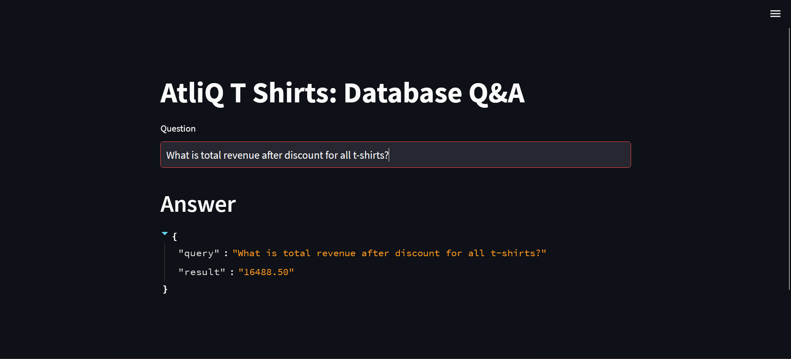

# Retail Q&A Tool (GenAI)

This project is a GenAI application that answers questions related to retail data using an LLM.

## Technologies Used
- Python (3.10.8)
- LangChain
- OpenRouter API
- Streamlit
- ChromaDB

## Files
- main.py : main application
- langchain_helper.py : helper functions for LangChain
- few_shots.py : few shot prompt examples

## How to Run
1. Install libraries  
pip install -r requirements.txt

2. Add your OpenRouter API key in .env

3. Run the app  
python main.py

## Project Demo

